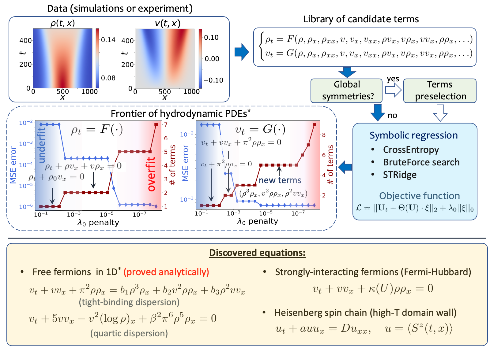

# "Discovering hydrodynamic equations of many-body quantum systems", [arXiv:2111.02385](https://arxiv.org/abs/2111.02385)

Framework for data-driven discovery of PDEs in many-body quantum systems from real-time dynamics

### Summary

In this project we develop a new machine-learning framework for automated discovery of effective equations describing dynamics of many-body quantum systems, thus bypassing complicated analytical derivations.  Using  integrable  models, where direct comparisons can be made, we reproduce previously known hydrodynamic equations, strikingly discover novel equations.  

### List of examples provided in the Jupyter notebooks

* Single magnon dynamics in 1D XXZ model
* Domain wall evolution in XXZ model (zero temperature and infinite temperature limits)
* Free fermion dynamics in a tight-binding J1-J2 model
* Interacting fermions dynamics in a spinless Fermi-Hubbard model
* Experimental data analysis: expansion of interacting boson gas on atom chip

## Citation

    @article{kharkov2021discovering,
      title={Discovering hydrodynamic equations of many-body quantum systems},
      author={Kharkov, Yaroslav and Shtanko, Oles and Seif, Alireza and Bienias, Przemyslaw and Van Regemortel, Mathias and Hafezi, Mohammad and Gorshkov, Alexey V},
      journal={arXiv preprint arXiv:2111.02385},
      year={2021}
    }
